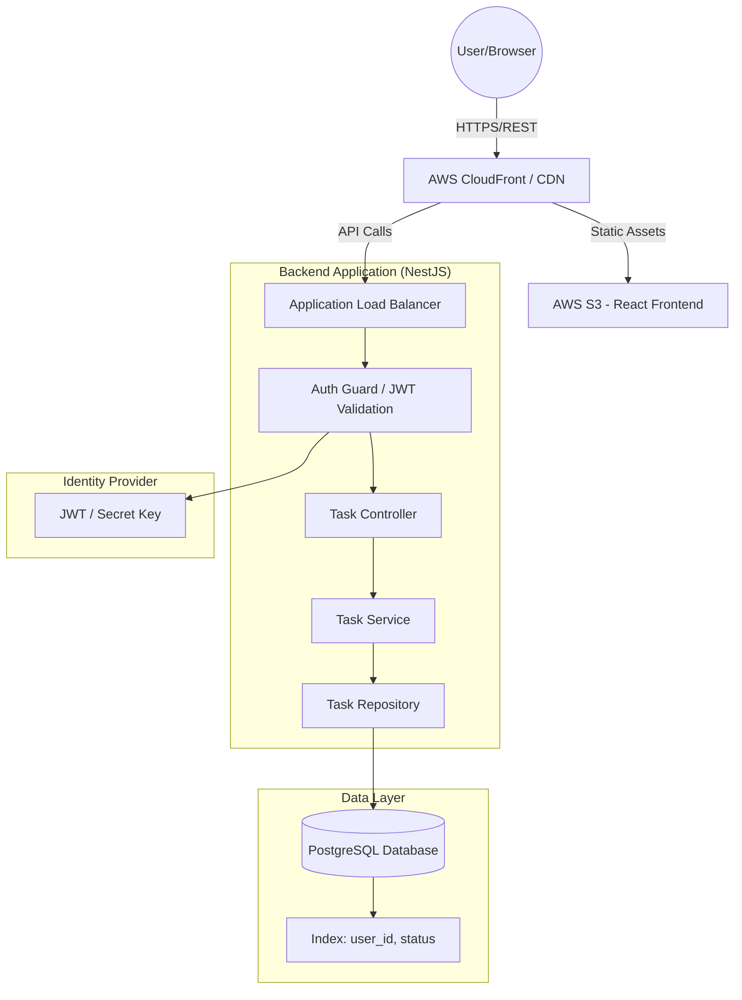

# High-Level Architecture (HLA): Simple Task Management System (STMS)

**Author:** Solution Architect  
**Status:** Final Design for Implementation  
**Version:** 1.0

---

## 1. System Overview
The STMS is a lean, secure, and scalable application designed for individual task management. The architecture follows a decoupled **Client-Server model** utilizing a RESTful API. The primary design drivers are **data isolation (multi-tenancy)**, **fast read performance**, and **developer velocity** for the MVP.

## 2. High-Level Architecture Diagram

---

## 3. Technology Stack & Trade-off Rationale

| Component | Technology | Rationale | Trade-off |
| :--- | :--- | :--- | :--- |
| **Frontend** | React + Tailwind CSS | Industry standard for SPAs; Tailwind allows rapid UI iteration and ensures responsiveness for Desktop/Tablet. | Larger bundle size than vanilla JS, but negligible for an MVP. |
| **Backend** | NestJS (Node.js) | TypeScript provides type safety; modular architecture prevents the "spaghetti code" common in early-stage Express apps. | Higher boilerplate compared to Express. |
| **Database** | PostgreSQL | Relational integrity is crucial for `user_id` mappings; supports complex indexing for status filtering. | More overhead than MongoDB, but avoids data duplication/consistency issues. |
| **Auth** | JWT (Stateless) | Scalable; no need for server-side session storage, allowing the backend to scale horizontally. | Token revocation requires a blacklist (Redis) if implemented in V2. |
| **Deployment** | Docker + AWS | Ensures environment parity from Dev to Prod. | Slightly more complex CI/CD pipeline setup. |

---

## 4. Data Flow & Schema

### 4.1 Database Schema (Relational)

**Table: `users`**
| Column | Type | Constraints | Description |
| :--- | :--- | :--- | :--- |
| `id` | UUID | PK, Unique | Primary Key |
| `email` | VARCHAR(255) | Unique, Not Null | User login identifier |
| `password_hash` | VARCHAR(255) | Not Null | Bcrypt hashed password |
| `created_at` | TIMESTAMP | Default NOW() | Account creation date |

**Table: `tasks`**
| Column | Type | Constraints | Description |
| :--- | :--- | :--- | :--- |
| `id` | UUID | PK, Unique | Primary Key |
| `user_id` | UUID | FK (users.id), Not Null | Owner of the task (IDOR Protection) |
| `title` | VARCHAR(255) | Not Null | Task headline |
| `description` | TEXT | Optional | Detailed notes |
| `status` | ENUM | Not Null | `TODO`, `IN_PROGRESS`, `COMPLETED` |
| `created_at` | TIMESTAMP | Default NOW() | Task creation date |
| `updated_at` | TIMESTAMP | Default NOW() | Last modification date |
| `deleted_at` | TIMESTAMP | Nullable | Soft-delete timestamp |

### 4.2 Critical Data Flow: Task Retrieval (Filtered)
1. **Request:** Client sends `GET /tasks?status=COMPLETED` + `Authorization: Bearer <JWT>`.
2. **Auth:** `AuthGuard` extracts `user_id` from JWT.
3. **Query:** Backend executes: 
   `SELECT * FROM tasks WHERE user_id = $1 AND status = $2 AND deleted_at IS NULL;`
4. **Optimization:** The DB uses a **Composite Index** on `(user_id, status)` to ensure $O(\log n)$ lookup time, meeting the < 2s latency requirement.

---

## 5. API Contract (OpenAPI Specification)

**Base URL:** `/api/v1`  
**Auth Header:** `Authorization: Bearer <token>`

### 5.1 Authentication
| Method | Endpoint | Request Body | Response | Description |
| :--- | :--- | :--- | :--- | :--- |
| `POST` | `/auth/login` | `{email, password}` | `200 {token}` | Authenticates user and returns JWT. |

### 5.2 Task Management
| Method | Endpoint | Request Body | Response | Description |
| :--- | :--- | :--- | :--- | :--- |
| `GET` | `/tasks` | Query: `status` | `200 [Task[]]` | List tasks for authenticated user. |
| `POST` | `/tasks` | `{title, description}` | `201 {Task}` | Create task. Default status: `TODO`. |
| `PATCH` | `/tasks/:id` | `{title, description, status}` | `200 {Task}` | Update task details or status. |
| `DELETE`| `/tasks/:id` | N/A | `204 No Content` | Soft-delete task (`deleted_at = now`). |

**Validation Rules:**
- `400 Bad Request`: If `title` is missing or `title.length > 255`.
- `401 Unauthorized`: If JWT is missing or expired.
- `403 Forbidden`: If `task.user_id !== request.user_id` (IDOR Protection).
- `404 Not Found`: If `task_id` does not exist or is already soft-deleted.

---

## 6. Non-Functional Requirements (NFRs)

### 6.1 Scalability
- **Horizontal Scaling:** The NestJS API is stateless. We can spin up multiple containers behind the ALB to handle increased traffic.
- **Database Scaling:** PostgreSQL can handle the MVP load easily. Future growth can be managed via Read Replicas for the `GET /tasks` endpoint.

### 6.2 Security
- **IDOR Prevention:** The `user_id` is never trusted from the request body; it is always injected from the verified JWT payload.
- **Input Sanitization:** Use of `class-validator` in NestJS to prevent XSS and SQL Injection.
- **Data at Rest:** Password hashing using **bcrypt** with a salt factor of 10.

### 6.3 Latency & Performance
- **Indexing:** Composite index on `(user_id, status)` to prevent full table scans.
- **Payload Optimization:** Frontend will implement a "Loading" state; API will return only necessary fields to minimize bandwidth.

### 6.4 Availability & Reliability
- **Soft Deletes:** To prevent irreversible data loss, the `deleted_at` flag ensures data can be recovered by an admin if necessary.
- **Health Checks:** ALB will perform `/health` checks every 30s to ensure traffic only hits healthy containers.