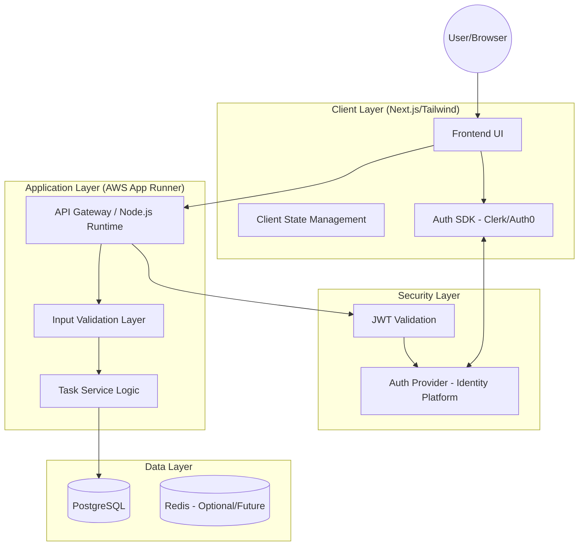

# High-Level Architecture (HLA): Simple Task Management System (MVP)

**Author:** Solution Architect  
**Status:** Final Design  
**Version:** 1.0  

---

## 1. Executive Architecture Overview
The system is designed as a **decoupled Single Page Application (SPA)** communicating with a **RESTful API**. To meet the strict < 200ms latency requirement and 99.9% availability, the architecture leverages a managed serverless compute layer and an optimized relational database. 

The design prioritizes **Data Isolation** at the database level and offloads Identity and Access Management (IAM) to a specialized provider to reduce the security attack surface.

### 1.1 Component Interaction Diagram


---

## 2. Technology Stack & Rationale

| Component | Technology | Rationale | Trade-off |
| :--- | :--- | :--- | :--- |
| **Frontend** | Next.js (React) + Tailwind CSS | Server-side rendering for fast initial load; Tailwind for rapid, responsive UI development. | Slightly larger bundle size vs. vanilla JS. |
| **Backend** | Node.js (TypeScript) + Express | Non-blocking I/O handles high concurrency; TypeScript ensures type safety for the Task entity. | Single-threaded event loop (mitigated by App Runner scaling). |
| **Infrastructure** | AWS App Runner | Fully managed container service. Handles auto-scaling and SSL without K8s complexity. | Higher cost than a raw EC2 instance, but lower OpEx. |
| **Database** | PostgreSQL (AWS RDS) | Relational integrity for User $\rightarrow$ Task mapping. Robust indexing for `user_id` and `due_date`. | Stricter schema than NoSQL; requires migrations. |
| **Authentication** | Clerk / Auth0 | P0 requirement for security. Offloads password hashing, MFA, and session management. | Dependency on 3rd party vendor. |
| **API Protocol** | REST / JSON | Standard, predictable, and easily cacheable. | Over-fetching of data (mitigated by lean API contracts). |

---

## 3. Data Flow & Schema

### 3.1 Database Schema (Entity Relationship)
The system uses a relational model to ensure strict data isolation.

**Table: `users`**
- `id`: UUID (PK) $\rightarrow$ Maps to Auth Provider `user_id`
- `email`: VARCHAR(255) (Unique)
- `created_at`: TIMESTAMP

**Table: `tasks`**
- `id`: UUID (PK)
- `user_id`: UUID (FK) $\rightarrow$ **INDEXED**
- `title`: VARCHAR(255) (NOT NULL)
- `description`: TEXT
- `due_date`: TIMESTAMP $\rightarrow$ **INDEXED**
- `category`: VARCHAR(50) (INDEXED)
- `is_completed`: BOOLEAN (Default: false)
- `created_at`: TIMESTAMP
- `updated_at`: TIMESTAMP

### 3.2 Critical Data Flow: Task Creation
1. **Request:** User submits form $\rightarrow$ Frontend attaches JWT in Header $\rightarrow$ `POST /api/tasks`.
2. **Auth:** API Gateway validates JWT via Auth Provider $\rightarrow$ Extracts `user_id`.
3. **Validation:** Business logic checks if `due_date` $\ge$ `now()`.
4. **Persistence:** DB executes `INSERT INTO tasks (user_id, title, ...)` using the `user_id` from the token (not the request body) to prevent **ID Spoofing**.
5. **Response:** Return 201 Created + Task Object.

---

## 4. API Contract

**Base URL:** `https://api.taskapp.com/v1`  
**Authentication:** `Authorization: Bearer <JWT_TOKEN>`

### 4.1 Task Endpoints

| Method | Endpoint | Description | Payload | Success Response |
| :--- | :--- | :--- | :--- | :--- |
| `GET` | `/tasks` | List tasks (filtered) | Query Params: `category`, `status` | `200 OK` $\rightarrow$ `Task[]` |
| `POST` | `/tasks` | Create task | `{ title, desc, due_date, category }` | `201 Created` $\rightarrow$ `Task` |
| `PUT` | `/tasks/:id` | Update task | `{ title, desc, due_date, category, is_completed }` | `200 OK` $\rightarrow$ `Task` |
| `DELETE`| `/tasks/:id` | Remove task | N/A | `204 No Content` |

**Example Request: Update Task**
`PUT /tasks/550e8400-e29b-41d4-a716-446655440000`
```json
{
  "title": "Updated Project Specs",
  "is_completed": true
}
```

---

## 5. Non-Functional Requirements (NFR) Implementation

### 5.1 Performance & Latency (< 200ms)
- **Database Tuning:** B-Tree indices on `(user_id, due_date)` to ensure $O(\log n)$ lookup time regardless of table size.
- **Connection Pooling:** Use `pg-pool` to eliminate the overhead of creating new DB connections per request.
- **Frontend Optimism:** Implement **Optimistic UI updates**. When a user toggles "Complete," the UI updates immediately; the API call happens in the background.

### 5.2 Security & Data Isolation
- **Token-Based Ownership:** The backend **never** trusts a `user_id` passed in the JSON body. It exclusively uses the `sub` claim from the verified JWT to filter database queries:
  `SELECT * FROM tasks WHERE id = $1 AND user_id = $2`
- **Input Sanitization:** Use parameterized queries to prevent SQL Injection.
- **CORS:** Strict Origin-allow-list to prevent unauthorized cross-site requests.

### 5.3 Scalability & Availability
- **Compute:** AWS App Runner scales horizontally based on CPU/Memory utilization.
- **Database:** RDS Multi-AZ deployment to ensure 99.9% availability via automatic failover.
- **Statelessness:** The API is entirely stateless; session data is stored in the JWT, allowing any instance of the app to handle any request.

---

## 6. Error Handling Matrix

| Error Code | Scenario | HTTP Status | Frontend Action |
| :--- | :--- | :--- | :--- |
| `AUTH_001` | Expired/Invalid Token | `401 Unauthorized` | Redirect to Login / Prompt re-auth |
| `VAL_001` | Deadline in the past | `400 Bad Request` | Show validation warning "Deadline cannot be in the past" |
| `SEC_001` | Accessing another user's task | `403 Forbidden` | Show "Resource not found" (to avoid leaking existence) |
| `SYS_001` | Database timeout | `500 Internal Error` | Show "Something went wrong, please try again later" |