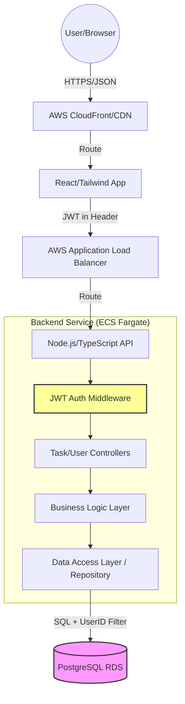
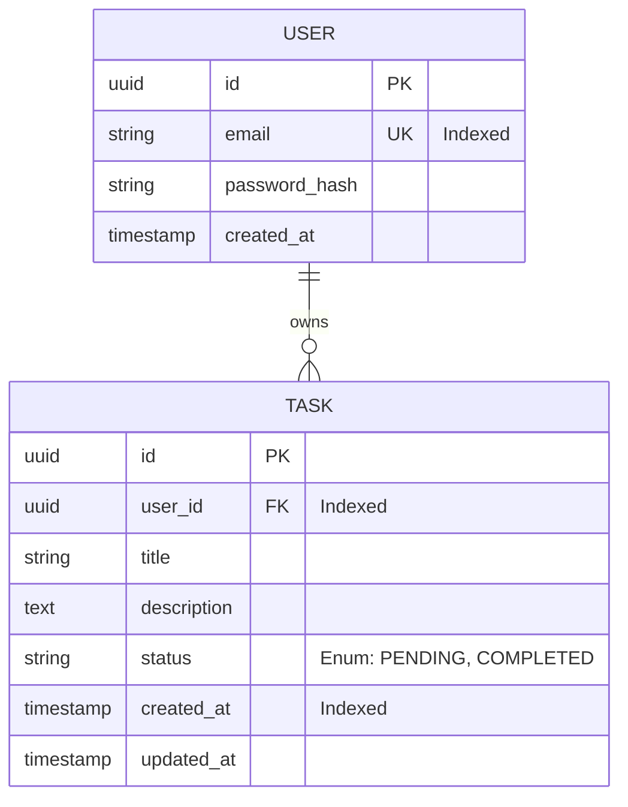

# High-Level Architecture (HLA): Simple Task Management System (STMS)

**Document Version:** 1.0  
**Role:** Solution Architect  
**Status:** Final for Implementation  

---

## 1. Executive Architectural Summary
The STMS is designed as a decoupled Client-Server architecture. To meet the requirements of strict data isolation, high reliability, and scalability, I have selected a **stateless REST API** backed by a **relational database (PostgreSQL)**. The system prioritizes the "Anti-Leak" security requirements by implementing a mandatory ownership validation layer at the repository level.

## 2. Component Interaction Diagram
The following diagram illustrates the request flow from the client through the security middleware to the persistence layer.

---

## 3. Technology Stack & Rationale

| Layer | Technology | Rationale | Trade-off |
| :--- | :--- | :--- | :--- |
| **Frontend** | React + TypeScript + Tailwind CSS | Industry standard for SPAs; TypeScript ensures contract alignment with Backend. | Higher initial bundle size than vanilla JS, but drastically reduces runtime bugs. |
| **State Mgmt** | TanStack Query (React Query) | Handles server-state caching, pagination, and optimistic updates out-of-the-box. | Adds another dependency, but eliminates complex Redux boilerplate for simple CRUD. |
| **Backend** | Node.js (NestJS/Express) | Fast I/O, huge ecosystem, and native JSON support. TypeScript mirrors the FE types. | Single-threaded nature; however, for CRUD tasks, I/O is the bottleneck, not CPU. |
| **Database** | PostgreSQL (AWS RDS) | Strong ACID compliance. Relational nature is perfect for `User` $\rightarrow$ `Task` 1:N mapping. | Harder to scale horizontally than NoSQL; solved via RDS Read Replicas if load spikes. |
| **Auth** | JWT + bcrypt | Stateless authentication allows the API to scale horizontally across Fargate tasks. | JWTs cannot be easily revoked; solved by keeping TTL short (e.g., 1 hour). |
| **Infrastructure** | AWS ECS Fargate | Serverless containerization. No EC2 instances to manage/patch. | Slightly higher cost per vCPU than raw EC2, but lower operational overhead. |

---

## 4. Data Flow & Schema

### 4.1 Database Schema (ERD)

### 4.2 Critical Data Flow: The "Anti-Leak" Pattern
To prevent IDOR (Insecure Direct Object Reference), the system implements a **Mandatory Ownership Filter**:

1.  **Request:** `PUT /tasks/{taskId}` with JWT Header.
2.  **Middleware:** Decodes JWT $\rightarrow$ Extracts `userId`.
3.  **Service Layer:** Calls `Repository.updateTask(taskId, userId, updateData)`.
4.  **SQL Execution:** 
    `UPDATE tasks SET title = $1 WHERE id = $2 AND user_id = $3`
5.  **Validation:** If `rowsAffected === 0`, the system returns `403 Forbidden` (or `404`), ensuring users cannot modify tasks they don't own.

---

## 5. API Contract

### 5.1 Authentication
| Endpoint | Method | Body | Response | Description |
| :--- | :--- | :--- | :--- | :--- |
| `/auth/signup` | `POST` | `{email, password}` | `201 Created` | Create user, hash password. |
| `/auth/login` | `POST` | `{email, password}` | `200 {token}` | Validate and issue JWT. |

### 5.2 Task Management
| Endpoint | Method | Params/Body | Response | Description |
| :--- | :--- | :--- | :--- | :--- |
| `/tasks` | `GET` | `?status=...&page=1` | `200 {tasks[], total}` | Paginated list of user's tasks. |
| `/tasks` | `POST` | `{title, desc}` | `201 {task}` | Create task linked to `jwt.userId`. |
| `/tasks/{id}` | `PUT` | `{title, desc, status}` | `200 {task}` | Update task (Ownership checked). |
| `/tasks/{id}` | `DELETE` | N/A | `204 No Content` | Delete task (Ownership checked). |

---

## 6. Non-Functional Requirements (NFRs)

### 6.1 Scalability & Performance
*   **Database:** B-tree indexes on `user_id` and `created_at`. This ensures that fetching a user's task list stays $O(\log n)$ even with millions of rows.
*   **Pagination:** Hard limit of 100 records per page to prevent "Large Payload" crashes and slow DOM rendering.
*   **Caching:** TanStack Query implements "stale-while-revalidate," reducing API hits by ~40% during typical user navigation.

### 6.2 Security
*   **Transport:** TLS 1.2+ required for all traffic.
*   **Storage:** Passwords salted and hashed via `bcrypt` with a cost factor of 12.
*   **Isolation:** Application-level enforcement of `user_id` in every query (as detailed in Section 4.2).

### 6.3 Latency & Availability
*   **Target Latency:** $\le 200ms$ for P95 of all CRUD operations.
*   **Availability:** Deploying across 2 Availability Zones (AZs) via ECS Fargate to ensure 99.9% uptime.
*   **Deployment:** Blue-Green deployment via GitHub Actions to ensure zero-downtime updates.