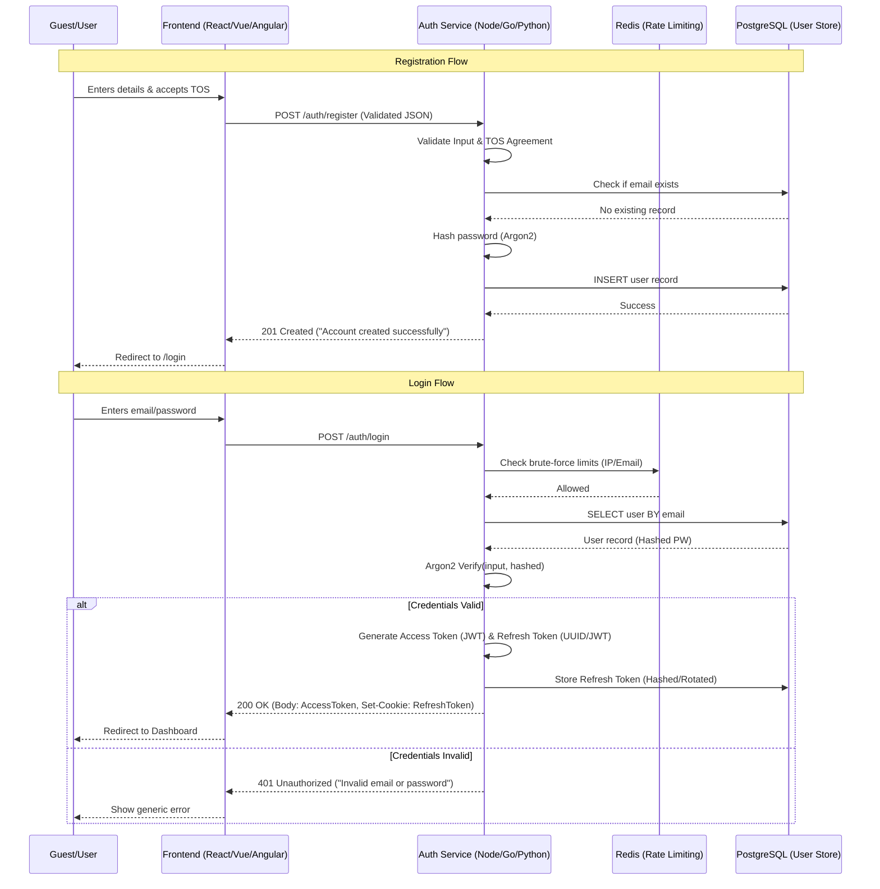

# High-Level Architecture (HLA): User Authentication Module

**Version:** 1.0  
**Role:** Solution Architect  
**Status:** Ready for Implementation  

---

## 1. Executive Summary
This document outlines the technical architecture for the User Authentication Module. The design prioritizes **security-first principles** to mitigate common vulnerabilities (XSS, CSRF, Account Enumeration) and ensures **GDPR compliance** through explicit consent tracking. The system utilizes a dual-token strategy (Access + Refresh) to balance user experience with a minimized attack surface.

---

## 2. System Architecture

### 2.1 Component Interaction Diagram
The system follows a decoupled Client-Server architecture. The Backend acts as the Single Source of Truth (SSoT) for identity, while the Frontend manages session state in memory.



---

## 3. Technology Stack & Trade-off Rationale

| Component | Technology | Rationale | Trade-off |
| :--- | :--- | :--- | :--- |
| **Language/Framework** | Node.js (TypeScript) / Fastify | High I/O throughput, excellent support for JWT/Argon2 libraries. | Single-threaded event loop; requires careful handling of CPU-intensive hashing. |
| **Database** | PostgreSQL | ACID compliance is non-negotiable for user identity and registration. | Slightly higher latency than NoSQL, but essential for data integrity. |
| **Hashing Algorithm** | Argon2id | Winner of Password Hashing Competition; resistant to GPU/ASIC cracking. | Higher memory/CPU cost per hash compared to bcrypt. |
| **Cache/Rate Limit** | Redis | Sub-millisecond latency for brute-force detection and session blacklisting. | Adds operational overhead (another piece of infra to manage). |
| **Token Format** | JWT (Access) / UUID (Refresh) | Access tokens allow stateless authorization; Refresh tokens allow server-side revocation. | JWTs cannot be revoked instantly unless a blacklist is maintained in Redis. |

---

## 4. Data Flow & Schema

### 4.1 Database Schema (PostgreSQL)
```sql
CREATE TABLE users (
    user_id UUID PRIMARY KEY DEFAULT gen_random_uuid(),
    email VARCHAR(255) UNIQUE NOT NULL,
    password_hash TEXT NOT NULL,
    tos_accepted BOOLEAN NOT NULL DEFAULT FALSE,
    tos_version VARCHAR(10) NOT NULL,
    created_at TIMESTAMP WITH TIME ZONE DEFAULT CURRENT_TIMESTAMP,
    updated_at TIMESTAMP WITH TIME ZONE DEFAULT CURRENT_TIMESTAMP
);

CREATE TABLE refresh_tokens (
    token_hash TEXT PRIMARY KEY,
    user_id UUID REFERENCES users(user_id) ON DELETE CASCADE,
    expires_at TIMESTAMP WITH TIME ZONE NOT NULL,
    created_at TIMESTAMP WITH TIME ZONE DEFAULT CURRENT_TIMESTAMP,
    revoked BOOLEAN DEFAULT FALSE
);

CREATE INDEX idx_users_email ON users(email);
```

### 4.2 Token Strategy
*   **Access Token (JWT):** 
    *   *Payload:* `{ "sub": "user_id", "role": "user", "exp": 15m }`
    *   *Storage:* Client-side memory (JS Variable).
*   **Refresh Token (Opaque/UUID):**
    *   *Storage:* `HttpOnly`, `Secure`, `SameSite=Strict` cookie.
    *   *Rotation:* Every time a refresh token is used to get a new access token, the old refresh token is revoked and a new one is issued (Refresh Token Rotation).

---

## 5. API Contract

### 5.1 Registration
`POST /api/v1/auth/register`

**Request Body:**
```json
{
  "email": "user@example.com",
  "password": "StrongPassword123!",
  "confirmPassword": "StrongPassword123!",
  "tosAgreed": true
}
```
**Responses:**
*   `201 Created`: `{ "message": "Account created successfully." }`
*   `400 Bad Request`: `{ "error": "VALIDATION_ERROR", "details": "Password does not meet security requirements." }`
*   `409 Conflict`: `{ "error": "EMAIL_EXISTS", "message": "Email is already in use" }`

### 5.2 Login
`POST /api/v1/auth/login`

**Request Body:**
```json
{
  "email": "user@example.com",
  "password": "StrongPassword123!"
}
```
**Responses:**
*   `200 OK`: 
    *   *Header:* `Set-Cookie: refreshToken=...; HttpOnly; Secure; SameSite=Strict; Max-Age=604800`
    *   *Body:* `{ "accessToken": "eyJhbG...", "expiresIn": 900 }`
*   `401 Unauthorized`: `{ "error": "AUTH_FAILED", "message": "Invalid email or password" }` (Generic message for both wrong email and wrong password).

### 5.3 Token Refresh
`POST /api/v1/auth/refresh`

**Request:** (Cookie: `refreshToken` sent automatically)
**Responses:**
*   `200 OK`: `{ "accessToken": "eyJhbG...", "expiresIn": 900 }`
*   `403 Forbidden`: `{ "error": "SESSION_EXPIRED", "message": "Please log in again." }`

---

## 6. Non-Functional Requirements (NFRs)

### 6.1 Scalability & Performance
*   **Latency:** To ensure $< 2\text{s}$ response time, Argon2 parameters (memory/iterations) will be tuned to hit a $\sim 500\text{ms}$ hashing window, leaving $1.5\text{s}$ for network and DB overhead.
*   **Concurrency:** Stateless JWTs allow the Auth Service to scale horizontally behind a Load Balancer.
*   **DB Performance:** Indexing on `email` ensures $O(1)$ lookup during login.

### 6.2 Security & Compliance
*   **Account Enumeration:** All failure paths in `/login` return a `401 Unauthorized` with identical messaging.
*   **Brute Force:** Redis implements a "Sliding Window" rate limiter. 5 failed attempts $\rightarrow$ 15-minute lockout for that IP/Email pair.
*   **XSS Mitigation:** No sensitive tokens stored in `localStorage`. Access token is in-memory; Refresh token is `HttpOnly`.
*   **GDPR:** `tos_accepted` and `tos_version` are stored in the DB to provide an audit trail of consent.

### 6.3 Reliability
*   **Input Sanitization:** Use of a parameterized ORM (e.g., Prisma or TypeORM) to eliminate SQL Injection risks.
*   **Validation:** Zod or Joi schema validation middleware to reject malformed JSON with `400 Bad Request` before reaching business logic.